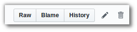
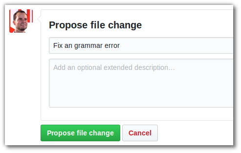

# Bitleaf blog

This repo contains the content of the [Bitleaf blog](https://bitleaf.de/blog). Everyone is welcome to add new or improve existing content. 

How to use
-----

  **1.** Login with your Github account (or create an account).

  **2.** Above, you see a list of files and folders. Click on the folder **_posts** and select the post you would like to edit.
  
  **3.** Press the **pen symbol** on the top right of the content:

  

  **4.** Do your edits. Use the **preview tab** to see the result.
  
  **5.** When you are finished, scroll down to the very bottom of the page. Just below **commit changes**, provide a short description of your changes. Finally, click on **propose file change**.

  

**That's all!** At that point I have already been notified about your suggestions for review. Make sure that your email settings of your Github account trigger a notification email to you after my review on your changes.

If I am happy with your edits, I'll merge it and your changes will immediately be public on the blog. If I am not super happy, I might  ask you for further improvements on your suggestion.

License
------

For this work, the [Creative Commons Attribution 4.0 International license](https://creativecommons.org/licenses/by/4.0/) applies. Any contributions are assumed to be licensed under the same license.

